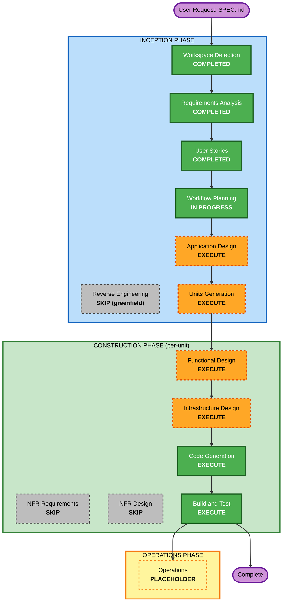

# Execution Plan — 청약레이더

## Detailed Analysis Summary

### Change Impact Assessment
- **User-facing changes**: Yes — 목록/상세/북마크/설정 4개 화면 신규 (E3~E5)
- **Structural changes**: Yes — 신규 시스템 아키텍처 (PWA 프론트 + Supabase BaaS + 수집 파이프라인)
- **Data model changes**: Yes — `notices` 스키마, 인덱스, RLS (E2)
- **API changes**: Yes — 4개 외부 소스 연동 어댑터 + Edge Function + Next.js 데이터 쿼리/AI 요약 라우트
- **NFR impact**: Yes(경량) — 인덱스(성능), 키 서버보관, 소스 에러 격리, RLS; 단 Security/Resiliency/PBT 확장은 Off(개인용)

### Risk Assessment
- **Risk Level**: Low~Medium
- **Rollback Complexity**: Easy (greenfield, 개인용, 외부 부작용 적음)
- **Testing Complexity**: Moderate (외부 API/크롤링 변동성, 목업 모드로 완화)
- **주요 불확실성**: data.go.kr API 응답 스키마, SH 페이지 HTML 구조, Free tier 한계

---

## Workflow Visualization



### Text Alternative
```
INCEPTION
- Workspace Detection ........ COMPLETED
- Reverse Engineering ........ SKIP (greenfield)
- Requirements Analysis ...... COMPLETED
- User Stories ............... COMPLETED
- Workflow Planning .......... IN PROGRESS
- Application Design ......... EXECUTE
- Units Generation ........... EXECUTE

CONSTRUCTION (per unit)
- Functional Design .......... EXECUTE
- NFR Requirements ........... SKIP
- NFR Design ................. SKIP
- Infrastructure Design ...... EXECUTE
- Code Generation ............ EXECUTE (always)
- Build and Test ............. EXECUTE (always)

OPERATIONS
- Operations ................. PLACEHOLDER
```

---

## Phases to Execute

### 🔵 INCEPTION PHASE
- [x] Workspace Detection (COMPLETED)
- [x] Reverse Engineering (SKIPPED — greenfield, no existing code)
- [x] Requirements Analysis (COMPLETED)
- [x] User Stories (COMPLETED — 24 stories, 5 Epics, 2 personas)
- [x] Execution Plan (IN PROGRESS)
- [ ] **Application Design — EXECUTE**
  - **Rationale**: 신규 시스템. 수집 어댑터·DB 액세스·UI·AI 요약·Push 등 컴포넌트와 책임/경계를 식별하고 서비스 계층을 설계해야 함.
- [ ] **Units Generation — EXECUTE**
  - **Rationale**: 데이터 파이프라인 / DB / 탐색·필터 UI / 상세·AI / 개인화·PWA 등 명확히 분리되는 다중 단위로 분해 가능. 병렬·순차 개발 단위 정의가 필요.

### 🟢 CONSTRUCTION PHASE (각 단위별 반복)
- [ ] **Functional Design — EXECUTE**
  - **Rationale**: 데이터 매핑(외부 응답→notices), 필터 로직(지역/면적/유형/순위/신혼), D-day/마감 처리, AI 요약 프롬프트·캐시 등 비즈니스 로직 상세 설계 필요.
- [ ] **NFR Requirements — SKIP**
  - **Rationale**: 기술 스택이 SPEC으로 이미 확정(Next.js 14/TS/Tailwind/Supabase/Vercel). NFR은 requirements.md(NFR-1..8)에 이미 정리됨. Security/Resiliency/PBT 확장 Off(개인용). 별도 NFR 도출 단계 불필요.
- [ ] **NFR Design — SKIP**
  - **Rationale**: NFR Requirements를 건너뛰므로 연동 스킵. 경량 NFR(인덱스·RLS·키 보관·에러 격리)은 Functional/Infrastructure Design에 흡수.
- [ ] **Infrastructure Design — EXECUTE**
  - **Rationale**: Supabase(PostgreSQL·RLS·Edge Function·pg_cron), Vercel 배포, Web Push(VAPID), 환경변수/시크릿 매핑 등 실제 인프라 서비스 매핑이 핵심.
- [ ] **Code Generation — EXECUTE (ALWAYS)**
  - **Rationale**: 실제 구현 — 프론트엔드, Edge Function 수집기, DB 마이그레이션, AI 요약 라우트.
- [ ] **Build and Test — EXECUTE (ALWAYS)**
  - **Rationale**: 빌드·단위/통합 테스트(목업 데이터 기반)·검증.

### 🟡 OPERATIONS PHASE
- [ ] Operations — PLACEHOLDER (향후 배포/모니터링 확장)

---

## v2 변경 (2026-06-24 Change Request) — 부부 전용 추천
- **추가 단위 U6**: 프로필·자격매칭·추천 엔진 (E6, FR-8~10).
- **U2 보강**: 마이그레이션 0004 — `notices.eligibility`(JSONB) + `household_profile` 테이블.
- **U1 보강**: 정규화에 자격조건 추출(C28) + 수집 지역 **서울·경기 한정**.
- **v2 잔여 구성 순서**: 0004 마이그레이션 → U1 criteria 보강 → **U6**(설계→코드) → U3(추천 피드) → U4(자격판정) → U5(PWA·Push).
- 완료 단위(U2/U1) 코드는 **보존**. 추가형.

## 제안 단위(Units) 미리보기 — Units Generation에서 확정
1. **U1 — 수집 파이프라인** (E1: cron + 4개 소스 어댑터 + 에러 격리 + 목업 모드)
2. **U2 — 데이터 플랫폼** (E2: notices 스키마/인덱스/RLS, Supabase 클라이언트)
3. **U3 — 탐색·필터 UI** (E3: 목록/필터/배지/D-day/설정)
4. **U4 — 상세·AI 요약** (E4: 상세 화면 + Claude 요약 + 캐시)
5. **U5 — 개인화·PWA·알림** (E5: 북마크/관심목록/PWA 설치/Web Push)

> 의존: U2 ← (U1 적재 대상) · U3·U4·U5 ← U2(데이터). U3~U5는 목업 데이터로 U1과 병행 개발 가능.

---

## Estimated Timeline
- **실행 단계 수**: INCEPTION 잔여 2개(App Design, Units) + CONSTRUCTION 단위별(FD/Infra/Code) ×5 단위 + Build&Test
- **흐름**: Application Design → Units Generation → (단위별: Functional Design → Infrastructure Design → Code Generation) → Build and Test

## Success Criteria
- **Primary Goal**: 관심 지역 청약·임대 공고를 매일 자동 수집·필터링해 제공하는 PWA 동작
- **Key Deliverables**: 수집 Edge Function(목업/실데이터) · notices DB+RLS · 4개 화면 PWA · Claude 자격요약 · Web Push
- **Quality Gates**: 목업 데이터로 목록/상세/필터/북마크 동작, upsert 중복 방지, 키 비노출, 빌드·테스트 통과
